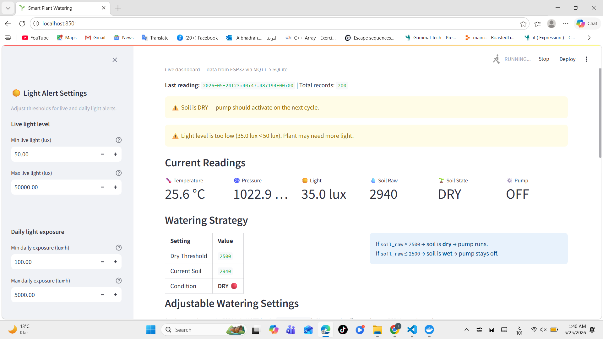
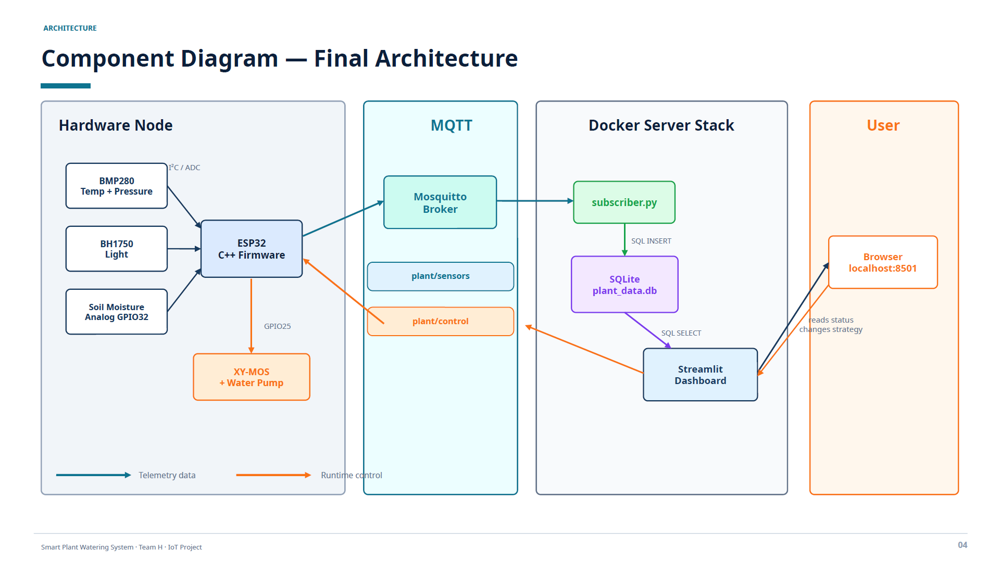
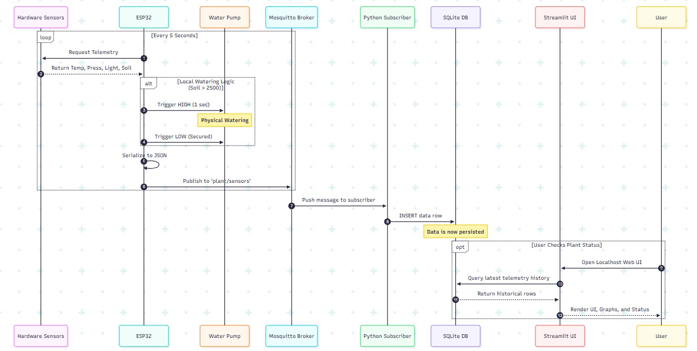
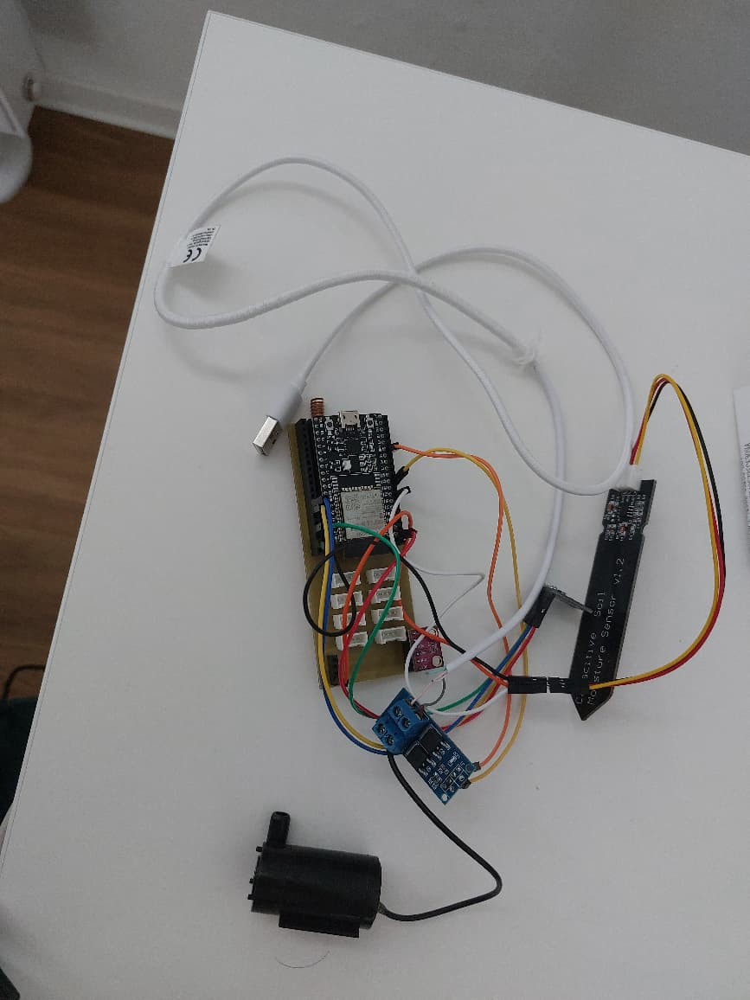
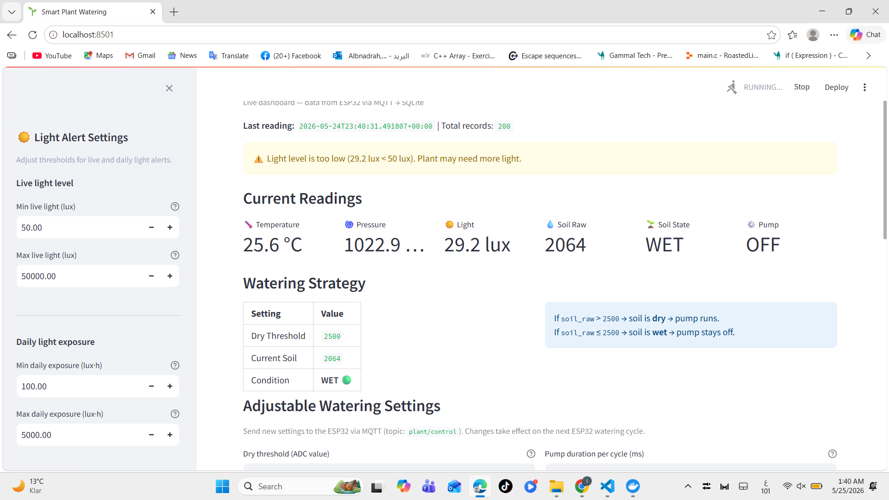
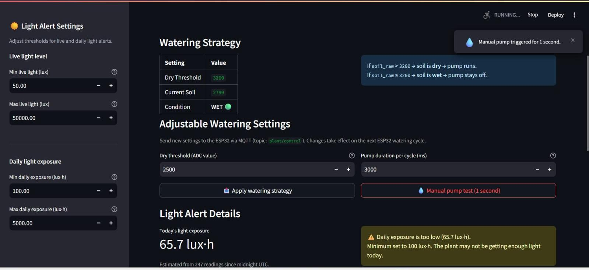
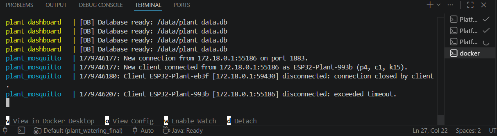

# Smart Plant Watering System

An IoT-based plant monitoring and automatic watering system using **ESP32**, **MQTT**, **Docker Compose**, **SQLite**, and **Streamlit**.

This project demonstrates an end-to-end IoT system that connects embedded hardware, sensor data acquisition, MQTT communication, persistent data storage, and a live web dashboard.

---

## Project Preview



*Live Streamlit dashboard showing plant status, soil condition, pump state, and sensor readings.*

---

## Project Overview

- The **ESP32** reads environmental and soil data every 5 seconds.
- The system monitors **temperature**, **pressure**, **light intensity**, and **soil moisture**.
- Based on the soil moisture value, the ESP32 decides whether watering is needed.
- A **water pump** is controlled automatically through a MOSFET/XY-MOS driver module.
- Sensor data is sent to the server over WiFi using **MQTT**.
- The server stores all readings in a **SQLite** database.
- A **Streamlit** dashboard visualises live and historical data in the browser.
- The user can adjust the watering strategy at runtime from the dashboard — no firmware reflash required.

---

## Key Features

- ESP32-based IoT sensor node with autonomous pump control
- Temperature and pressure measurement using **BMP280**
- Light intensity measurement using **BH1750**
- Soil moisture measurement using an analog sensor
- Automatic pump activation based on a configurable dry threshold
- Runtime-adjustable dry soil threshold
- Runtime-adjustable pump activation duration
- Manual pump test from the dashboard
- MQTT telemetry (`plant/sensors`) and control (`plant/control`) topics
- SQLite data logging with a shared Docker volume
- Streamlit dashboard with live readings, status cards, and history charts
- Light level alerts and daily light exposure monitoring
- Fully containerised server stack using **Docker Compose**

---

## System Architecture



The architecture is divided into three main layers:

| Layer | Components |
|---|---|
| **Hardware node** | ESP32, BMP280, BH1750, soil sensor, XY-MOS driver, water pump |
| **MQTT broker** | Eclipse Mosquitto on port 1883 |
| **Server stack** | Python subscriber, SQLite database, Streamlit dashboard |

**Data path:**
`ESP32 → plant/sensors → Mosquitto → subscriber.py → SQLite → Streamlit`

**Control path:**
`Streamlit → plant/control → Mosquitto → ESP32`

This bidirectional design allows the system to both monitor the plant and control the ESP32 at runtime, without any firmware changes.

---

## Runtime Sequence



1. The ESP32 reads all sensors every **5 seconds**.
2. It compares the soil moisture value against the configured **dry threshold**.
3. If the soil is dry, the pump is activated for the configured **pump duration**.
4. The ESP32 publishes a JSON telemetry message to `plant/sensors`.
5. The subscriber receives the message and writes a row to SQLite.
6. The dashboard reads the database and refreshes the interface automatically.
7. The user can send control commands back to the ESP32 via `plant/control`.

---

## Hardware Setup



| Component | Role |
|---|---|
| ESP32 Dev Module | Main microcontroller |
| BMP280 | Temperature and pressure (I2C, address 0x76) |
| BH1750 | Ambient light intensity (I2C, address 0x23) |
| Analog soil moisture sensor | Soil water content via ADC on GPIO32 |
| XY-MOS / MOSFET driver | Safe pump switching |
| Mini water pump | Water delivery to the plant |

**Pin mapping:**

| Signal | GPIO |
|---|---|
| Soil sensor AOUT | 32 |
| Pump control (XY-MOS TRIG) | 25 |
| I2C SDA | 21 |
| I2C SCL | 22 |

The pump is not driven directly from the ESP32 GPIO pin. Instead, the ESP32 sends a low-current control signal to the XY-MOS MOSFET driver, which switches the pump load safely from an external power supply.

---

## MQTT Topics

| Topic | Direction | Purpose |
|---|---|---|
| `plant/sensors` | ESP32 → Server | Publishes sensor readings and pump state |
| `plant/control` | Dashboard → ESP32 | Sends runtime control commands |

**`plant/sensors` fields:**
`plant_id`, `temperature_c`, `pressure_hpa`, `light_lux`, `soil_raw`, `soil_state`, `pump`, `dry_threshold`, `pump_duration_ms`, `uptime_ms`

**`plant/control` fields:**
`dry_threshold`, `pump_duration_ms`, `manual_pump_ms`

All `plant/control` fields are optional — send only the ones you want to update. `manual_pump_ms` triggers the pump immediately for the given duration (maximum 5000 ms).

Using separate telemetry and control topics keeps the communication clean, directional, and easy to debug.

---

## Dashboard

| Dry State | Wet State |
|---|---|
|  |  |



The Streamlit dashboard provides:

- **Live sensor cards** — temperature, pressure, light, soil value
- **Soil status** — DRY or WET with a visual alert
- **Pump status** — ON or OFF indicator
- **History charts** — temperature, light, soil moisture, and pressure over time
- **Adjustable dry threshold** — change when the pump triggers
- **Adjustable pump duration** — control how long the pump runs
- **Manual pump test** — activate the pump for 1 second from the browser
- **Light alert settings** — configurable minimum and maximum lux thresholds
- **Daily light exposure** — accumulated lux-hours estimated from stored readings

The dashboard allows the user to change watering parameters and send them directly to the ESP32 via MQTT, without modifying or reflashing the firmware.

---

## Server Runtime



The server side runs using Docker Compose and starts three services together:

| Service | Description |
|---|---|
| `mosquitto` | Eclipse Mosquitto MQTT broker on port 1883 |
| `subscriber` | Python service — receives MQTT messages and writes to SQLite |
| `streamlit` | Streamlit dashboard on port 8501 |

The subscriber and dashboard share the SQLite database through a named Docker volume, so both services always access the latest data without any extra configuration.

---

## Demo Video

[Watch the demo video](docs/demo/smart_plant_watering_demo.mp4)

---

## How to Run

### 1. Start the server stack

```bash
cd plant_server
docker compose up --build
```

Open the dashboard at **http://localhost:8501**

Stop the stack with:

```bash
docker compose down
```

### 2. Flash the ESP32 firmware

Open `src/main.cpp` and update the WiFi and MQTT settings:

```cpp
const char* WIFI_SSID     = "YourNetworkName";
const char* WIFI_PASSWORD = "YourPassword";
const char* MQTT_SERVER   = "192.168.x.x";  // your machine's local IP
```

> **Find your IP on Windows:** run `ipconfig` and look for the IPv4 Address of your active network adapter.

Upload using PlatformIO (VS Code **Upload** button or CLI):

```bash
pio run --target upload
```

### 3. Raspberry Pi deployment (optional)

The same Docker Compose stack runs on a Raspberry Pi without any changes:

```bash
cd plant_server
docker compose up --build -d
```

Update `MQTT_SERVER` in `main.cpp` to the Pi's IP address, re-upload the firmware, and the dashboard is accessible from any device on the local network at `http://<pi-ip>:8501`.

---

## Tech Stack

| Layer | Technology |
|---|---|
| Firmware | C++ / Arduino framework (PlatformIO) |
| Microcontroller | ESP32 |
| Sensors | BMP280, BH1750, analog soil sensor |
| Messaging | MQTT — Eclipse Mosquitto |
| Backend | Python, paho-mqtt, SQLite |
| Dashboard | Streamlit |
| Infrastructure | Docker, Docker Compose |

---

## Learning Outcomes

This project helped me practice:

- Embedded sensor integration with ESP32
- I2C communication with BMP280 and BH1750
- Analog sensor reading using ESP32 ADC
- MQTT-based IoT communication
- Hardware-software integration
- Pump control through a MOSFET driver
- SQLite-based local data logging
- Streamlit dashboard development
- Docker Compose deployment
- Runtime configuration of IoT devices

---
## Future Improvements

- Add MQTT username/password authentication
- Add TLS encryption for MQTT communication
- Add dashboard access control
- Deploy the server permanently on a Raspberry Pi
- Add a water tank level sensor
- Add hysteresis to avoid rapid pump cycling near the threshold
- Support multiple plants with individual watering profiles
- Improve enclosure and cable management

---

## Project Structure

```
smart-plant-watering-system/
├── src/
│   └── main.cpp              # ESP32 firmware — sensors, pump logic, MQTT
├── platformio.ini            # PlatformIO project configuration
├── plant_server/
│   ├── subscriber.py         # MQTT subscriber → SQLite writer
│   ├── streamlit_app.py      # Streamlit dashboard
│   ├── database.py           # SQLite helper
│   ├── requirements.txt      # Python dependencies
│   ├── Dockerfile
│   ├── docker-compose.yml    # Full server stack definition
│   └── mosquitto.conf        # Mosquitto broker configuration
└── docs/
    ├── images/               # Architecture, hardware, and dashboard screenshots
    └── demo/                 # Demo video
```
